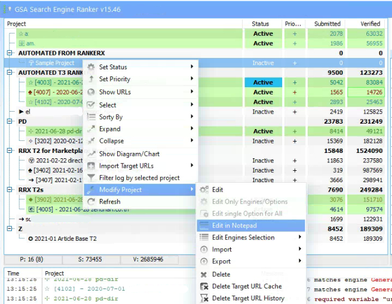
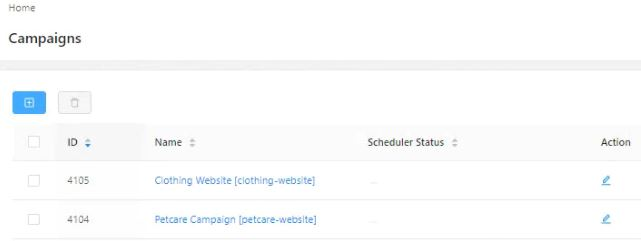

# RankerX_GSA_Bot 🤖
Automatically create GSA Projects from backlinks generated by RankerX

If you're like me you script almost every repeatable task that needs to be done more than a few times. If you build backlinks using RankerX and then create more backlinks to those backlink with GSA Search Enginer Ranker (GSA-SER)  you might have found this to be arduous processs that involves a lot of steps. 

The RankerX_GSA_Bot can automate this task and start building a project GSA using a .prj file (a native INI file defined by GSA) as soon as RankerX is finished with the campaign.

###### Requirements
1. Python 3.6 or later
2. Windows operating system with local copy of GSA-SER

## Installation Instructions:

1. Copy the files for RankerX_GSA_Bot to any folder, for example "c:\RankerX_GSA_Bot"
2. Install the Python requrements from inside your c:\RankerX_GSA_Bot folder:

```
pip install -r requirements.txt
```

### Configure default GSA Project and Article template file and save them to c:\RankerX_GSA_Bot. 

GSA-SER stores all of its project-level configurations in **.prj** files, and the list of articles for to the project in **.article files**. The title of the .prj file name is the title of the project as shown in GSA, and the .articles file must have the same name exactly except replace the .prj extension with .articles. 

How to create a new .prj template:

1. Create a new project in GSA. Configure all of the settings per your preferences and import or create. The RankerX_GSA_Bot will use this file to generate new projects when it runs. 

2. Once you're happy with the settings, right click and select "Modify Project" -> "Edit in Notepad"


3. Now you need to edit a few lines and then save the file to your c:\RankerX_GSA_Bot folder:

```
URL={{URL_LIST}}
group=AUTOMATED T3 RANKERX
notes={{notes}}
last status=active
pop3 pw=##clear_text_password
```

- Delete anything that you configured in the URL list from within GSA. The RankerX_GSA_Bot 🤖 will replace `{{URL_LIST}}` with the backlinks coming from your RankerX campaign.
- Set `group` to something (or nothing) to reflect these are auto-generated projects
- `notes` is unused in this version, but may be added later
- If you configure `last status=active` then the project will automatically start running right away. If you want to be set Inactive, set this value to `0`.
- `pop3 pw` (and I assume the same for IMAP, but have not tested) are stored encrypted in the INI file when saved from GSA. If you've specified a POP3 password from within GSA, you have to replace this encrypted line with the password in clear text and insert a leading double-hashtag `##` so GSA knows it's unencrypted.
- Save the file using **UTF-8** encoding (if editing in Notepad, don't select the UTF-8 with BOM option)
- Be certain the file is saved with a `.prj` extension. Notepad likes to append .txt, so you may need to edit this.

4. Finally, find the **.articles** file from your new GSA project copy it to your c:\RankerX_GSA_Bot folder. If you have no articles, you still need a file, but it can be blank.


###  Set up your config.json file in c:\RankerX_GSA_Bot:

```
{
    "rankerx_url": "http://localhost:8080",
    "rankerx_username": "",
    "rankerx_password": "",
    "gsa_prj_path": "C:\\Users\\User\\AppData\\Roaming\\GSA Search Engine Ranker\\projects",
    "gsa_prj_template_file_default": "GSA_Sample_Project.prj",
    "gsa_prj_article_file_default": "GSA_Sample_Project.articles",
    "use_rankerx_anchor_default": false,
    "gsa_project_config": {
        "tag1": {
            "gsa_prj_template_file": "GSA_Sample_Project.prj",
            "gsa_prj_article_file": "GSA_Sample_Project.articles",
            "use_rankerx_anchor": false
        },
        "tag2": {
            "gsa_prj_template_file": "GSA_Sample_Project.prj",
            "gsa_prj_article_file": "GSA_Sample_Project.articles",
            "use_rankerx_anchor": false
        }
    },
    "campaigns_completed": [
    ]
}
```

- `rankerx_url` is `http://localhost:8080` or whatever will access your running instance. The username/password is the same that you use to log into RankerX.
- The GSA `gsa_prj_path` variable is where your .prj files are stored for GSA-SER. Keep in mind that .json files need the `\` character escaped with a second `\` character. 
- The RankerX_GSA_Bot 🤖 can use a default GSA template for all of your new projects, and it can also use a unique project for each tag that you specify. 

### Why would you want tags? 
Perhaps you are building backlinks to a clothing website from RankerX, and you want your GSA project to also use articles, keywords, and other settings related to the clothing niche. At the same time, you are building backlinks to a Pet Care niche website, so you want the GSA project for this to use different articles and settings. In this case, specify tags in your config.json file like this (using correct JSON formatting):

```
 "gsa_project_config": {
        "clothing-website": {
            "gsa_prj_template_file": "GSA_ClothingWebsite_Project.prj",
            "gsa_prj_article_file": "GSA_ClothingWebsite_Project.articles",
            "use_rankerx_anchor": false
        },
        "petcare-website": {
            "gsa_prj_template_file": "GSA_PetCareWebsite_Project.prj",
            "gsa_prj_article_file": "GSA_GSA_PetCareWebsite_Project.articles",
            "use_rankerx_anchor": false
        }
```

The RankerX_GSA_Bot 🤖 will know to select the proper GSA project and article files when it synchronizes the project from RankerX. 

### How to configure matching tags inside RankerX
How does the bot know which tag to use? You have to configure your project name in RankerX with the tag inside square brackets [ ], like this:

```
Project #1 Name [clothing-website]
Project #2 Name [petcare-website]
```


## Running the bot

Once you have your config.json prepared and have created template .prj and .articles files, you can test the bot by running it like this:

```
python rankerx_gsa_bot.py
```

If it seems to work, schedule this command to run as often as you like using Task Scheduler. 

Now when the bot runs, it will check RankerX campaigns, skipping over campaign IDs that it has worked on before and looking at the tasks inside. If all are complete, it will download all of the backlink URLs, edit your project template file (.prj) for you and then copy it to the GSA folder. Finally the bot will call the GSA api to tell it to refresh itself and load the project.

Now you can have the tier below your RankerX tier created almost completely hands-off! 

## Issues and Future Features
The bot may be good enough, so future development is not planned yet. But here are a few limitations:

- [ ] Enable project tags to point to different GSA-SER instances (in the case of having one RankerX instance but multiple GSA-SER instances running)
- [ ] Better error handling and notifications. Bots really should let you know when there's a problem, but this one isn't smart enough yet.
- [ ] Do other things with your RankerX backlinks, such as submitting them to your private custom fast indexer or building a report for a client
- [ ] Do other things with RankerX, such as automatically generating a new X-Wizard campaign (in case you like to run the same campaigns over multiple times without major changes)

Feel free to open up an issue or submit pull requests if you'd like to help develop the bot.
